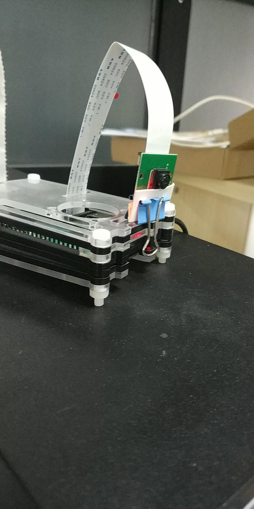

# hh_rsp
树莓派安防摄像头

## Usage
- pi-motion-lite.py is main python code detection motion and capture frame into jpg file
- run_py.sh is the script backup captured image to remote server
- run_web.sh  is the simple web server

'''shell
python pi-motion-lite.py

sh run_web.sh

sh run_py.sh (in crontab)

'''

